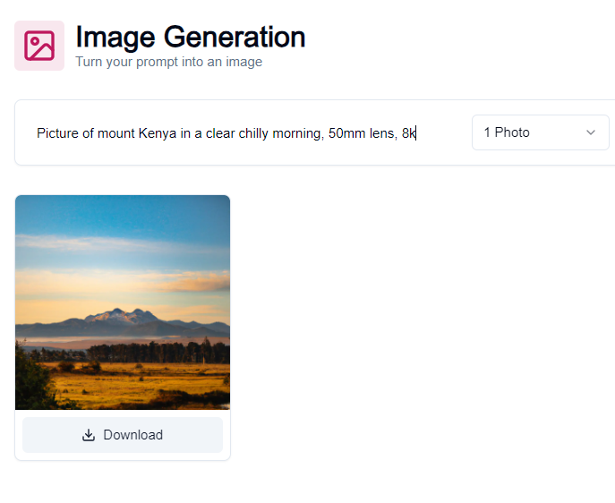

# Chordio AI

## Overview

Chordio AI is an AI-powered music creation platform that allows you to generate music, create covers, and chat with an AI music expert.
It is based on OpenAI and other AI models, and it offers 3 free tries and a pro tier with unlimited features.

### Features

- Generate music: Chordio AI can generate original music in a variety of genres, including pop, rock, jazz, and classical. You can specify the tempo, key, and style of the music, and Chordio AI will create a unique piece of music for you.

- Create covers: Chordio AI can also create covers of your favorite songs. Just upload the song file, and Chordio AI will create a new version of the song with your own vocals and instruments.

- Chat with an AI: Chordio AI also has an AI music expert that you can chat with. The AI expert can answer your questions about music theory, composition, and production.
  Pricing

The pro tier costs $20 per month and removes all limits.

### Getting Started

To get started with Chordio AI, sign up for a free account.
Once you have created an account, you can start generating music, creating covers, and chatting with the AI music expert.

